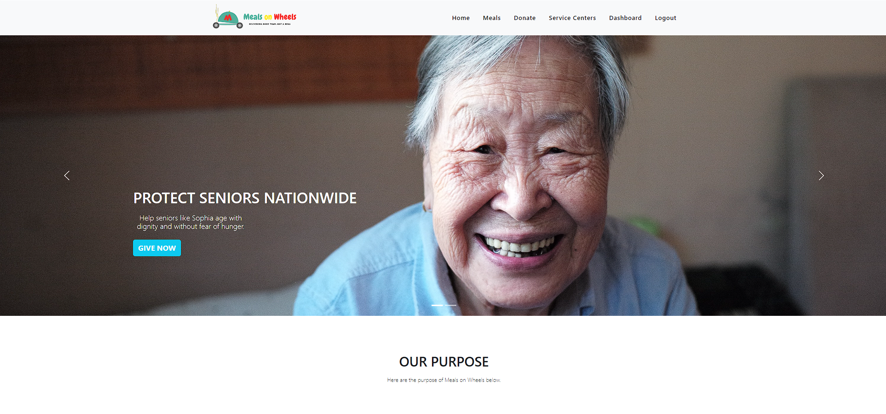
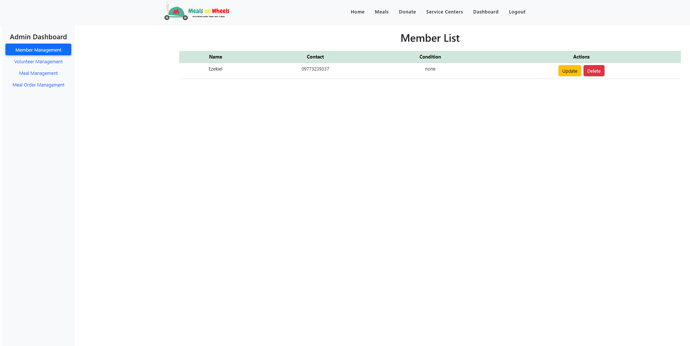
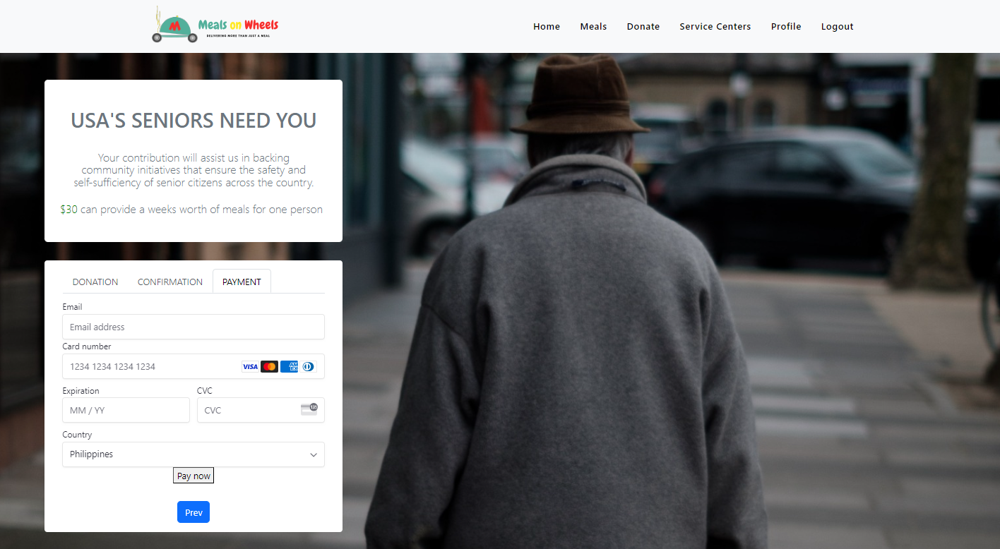
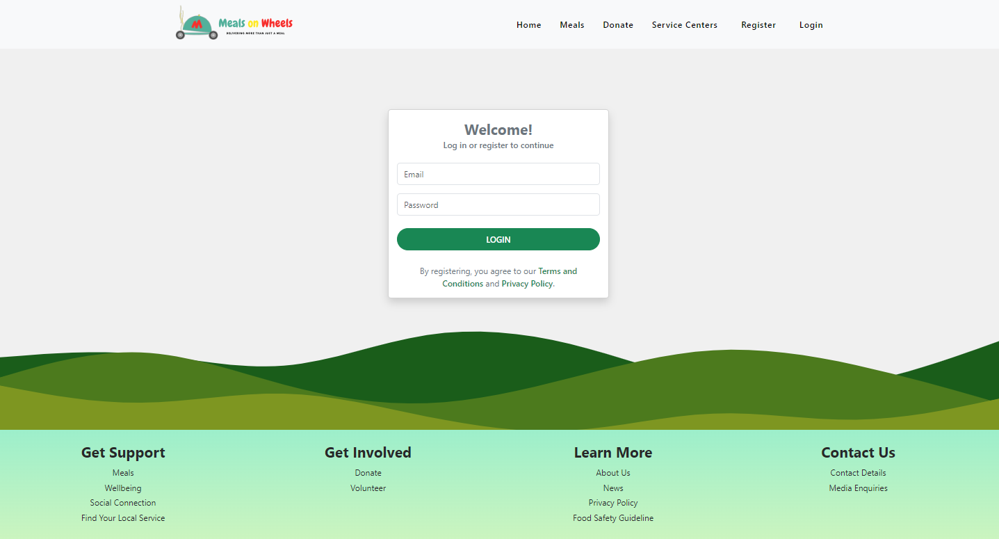
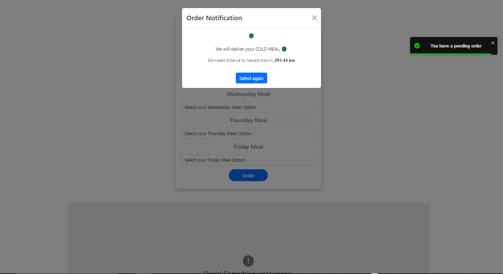

# Merry Meals Project 🍔🥗🥤

Welcome to the Merry Meals project! This project is designed to provide a convenient meal ordering system based on your proximity to the food pickup location. It's a simple yet efficient way to ensure that everyone gets their meals at the right temperature.

## Table of Contents
- [About Merry Meals](#about-merry-meals) 🔥
- [Stack](#stack) 🔥
- [Preview](#preview) 🔥
- [Usage](#usage) 🔥
- [Disclaimer](#disclaimer) 🔥

---

## About Merry Meals 

Merry Meals is a web-based application that offers a unique solution for meal delivery. The primary logic behind Merry Meals is the geographical proximity of the user to the food pickup location. Here's how it works:

- Users located within a 10-kilometer radius from the pickup location can order hot meals.
- Users located beyond the 10-kilometer radius will be delivered cold meals. 🌡️❄️

This approach ensures that users receive their meals at the optimal temperature, enhancing their dining experience.

## Stack

Merry Meals is built using the following technologies: 

- **Frontend**: React ⚛️ , Boostrap 
- **Backend**: Java ☕, Spring Boot 🍃
- **Database**: MySQL 🐬
- **HTTP Requests**: Axios 🌐
- **Version Control**: Git 📜

## Preview

*Home Page*

*Admin Dashboard*

*Donor Dashboard*

*Login Page*

*Order Page*

## Usage 

To use Merry Meals, follow these steps:

1. Clone the repository to your local machine.
2. Set up the database by importing the SQL schema provided. ( inside the backend folder named " mow_backend.sql " ) 
3. Configure the backend by updating the Spring Boot application properties.
4. Run the backend server.
5. Navigate to the frontend directory and run the React application.
6. Access the web application in your browser.

Feel free to explore the codebase and customize it to your needs. Merry Meals is an educational project, and some of the ideas, designs, and logic are inspired by my colleagues. 🌐💻

## Disclaimer 

This project is for educational purposes only. It serves as a demonstration of various technologies and concepts in web development. The ideas, designs, and logic in this project may have been inspired by the work of others in the web development community by my batch and colleagues. We acknowledge and appreciate the contributions of the broader web development community to the field. 🙏

If you have any questions or suggestions, please feel free to reach out.

Happy coding! 🚀
